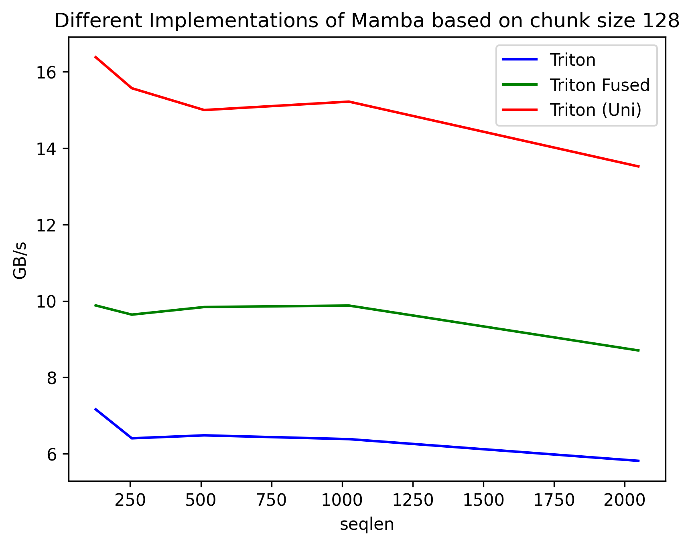

# FusedVim

An implementation of bidirectional Mamba (used in [**Vision Mamba**](https://github.com/hustvl/Vim)) operations using fused Triton kernels for improved GPU efficiency.

## Overview

This project implements optimized bidirectional Mamba operations, based on the original mamba-ssm 2.2.4:
- **Triton**: Separate forward and backward passes combined (original BiMamba)
- **Triton Fused**: Single fused bidirectional kernel  (this repo)
- **Triton (Uni)**: Unidirectional baseline

## Requirements

```
torch                     2.6.0+cu124
torchaudio                2.6.0+cu124
torchvision               0.21.0+cu124
triton                    3.2.0
```

## Usage

### Testing Correctness
```bash
python bimamba_correctness.py
```

### Benchmarking Performance  
```bash
python triton_benchmark.py
```

## Performance Results

The fused implementation shows significant performance improvements:



**Key Results:**
- **Average Speedup**: 1.49× (49% faster)
- **Memory Bandwidth**: Up to 9.88 GB/s vs 7.16 GB/s baseline
- **Sequence Length Range**: 128-2048 tokens tested

The fused kernel consistently outperforms separate bidirectional passes across all sequence lengths, with speedups ranging from 1.38× to 1.55×. We show the UniDirectional Mamba for comparison. 

## Benchmark Environment

- **GPU**: NVIDIA GeForce RTX 4070 Mobile (8GB VRAM)
- **CUDA**: 12.4
- **Driver**: 550.144.03

## Architecture

- `mamba_ssm/ops/triton_bi/`: Fused bidirectional implementations
- `mamba_ssm/ops/triton/`: Original unidirectional kernels  
- `mamba_ssm/modules/`: High-level module interfaces

## Acknowledgments

This work builds upon:
- [**Mamba**](https://github.com/state-spaces/mamba) - Original SSM architecture and implementation
- [**Triton**](https://github.com/triton-lang/triton) - GPU kernel compilation framework for high-performance computing
